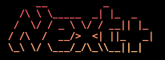

# Next+



Welcome to the Next+ CLI tool. A supercharged alternative to create-next-app.

To get started:

```
bunx create next-plus@latest
# or
npx create-next-plus@latest
```

---

## Features 🚀

- Next.js 14 App Router
- tRPC
- TailwindCSS
- LangchainJS (optional)
- Million.js (optional)
- Drizzle with Supabase (PostgresQL) or PlanetScale (MySQL) setup. Prefer Firebase? We got you covered too.

---

This project was created using `bun init` in bun v1.0.20. [Bun](https://bun.sh) is a fast all-in-one JavaScript runtime.
